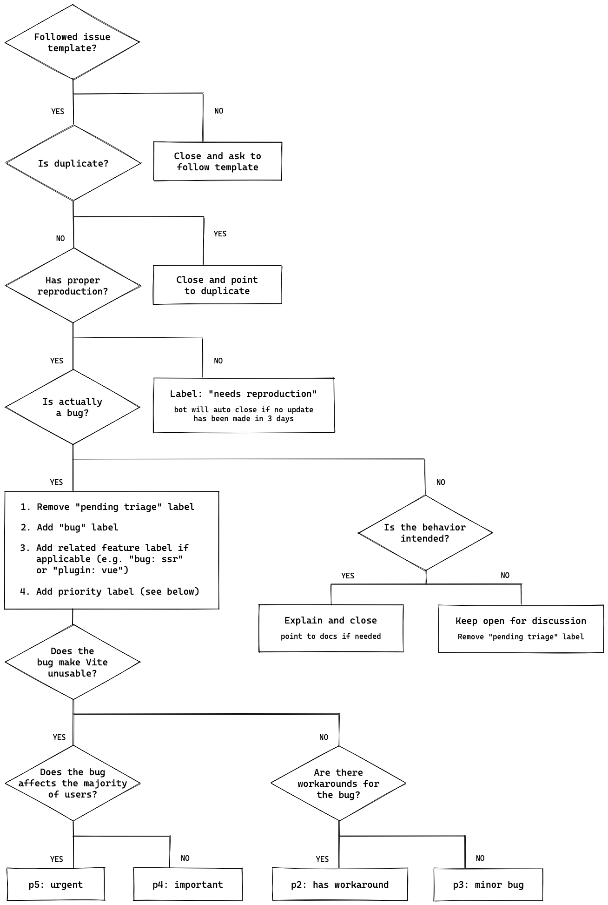

# C4ISTAR-WEB Contributing Guide

Before submitting your contribution, please make sure to take a moment and read through the following guidelines:

- [Issue Reporting Guidelines](#issue-reporting-guidelines)
- [Pull Request Guidelines](#pull-request-guidelines)
- [Development Setup](#development-setup)
- [Project Structure](#project-structure)
- [Git Hooks](#git-hooks)
- [Committing Changes](#committing-changes)
- [Commonly used NPM scripts](#commonly-used-npm-scripts)
- [Maintainers](#maintainers)

## Issue Reporting Guidelines

- Always when you want to report new issue you have to follow this workflow



also it should contain the following:

- **Use a clear and descriptive title** for the issue to identify the problem.
- **Describe the exact steps which reproduce the problem** in as many details as possible. For example, start by explaining how you started the project, e.g. which command exactly you used in the terminal, or how you started the module, e.g. which command exactly you used in the terminal, which environment variables you set, etc. When listing steps, **don't just say what you did, but explain how you did it**. For example, if you moved the cursor to the end of a line, explain if you used the mouse, or a keyboard shortcut or an editor menu, etc.
- **Provide specific examples to demonstrate the steps**. You can link to a live example on [CodeSandbox](https://codesandbox.io/) or similar.
- **Describe the behavior you observed after following the steps** and point out what exactly is the problem with that behavior.
- **Explain which behavior you expected to see instead and why.**
- **Example:** [vue-new-issue](https://new-issue.vuejs.org/) is a good template to use for bug reports.

## Pull Request Guidelines

- The `main` branch is just a snapshot of the latest stable release. All development should be done in dedicated branches. **Do not submit PRs against the `main` branch.**

- Checkout a topic branch from the relevant branch, e.g. `dev`, and merge back against that branch.

- Work in the `src` folder and **DO NOT** checkin `dist` in the commits.

- It's OK to have multiple small commits as you work on the PR - GitHub will automatically squash it before merging.

- Make sure `pnpm test:unit --run` passes. (see [development setup](#development-setup))

- If adding a new feature:

  - Add accompanying test case, its mean if your commit is `feat: add new feature` you should add test case for it in `test/unit/specs/` folder.
  - Provide a convincing reason to add this feature. Ideally, you should open a suggestion issue first and have it approved before working on it, so that you don't end up working on something that will eventually be rejected for some reason or change.

- If fixing bug:
  - If you are resolving a special issue, add `(fix #xxxx[,#xxxx])` (#xxxx is the issue id) in your PR title for a better release log, e.g. `update entities encoding/decoding (fix #3899)`.
  - Provide a detailed description of the bug in the PR.
  - Add appropriate test coverage if applicable.

## Development Setup

You will need [Node.js](http://nodejs.org) **version 16+**, [Cypress](https://cypress.io) (for running Cypress server during e2e tests) and [pnpm](https://pnpm.io/).

After cloning the repo, run:

```bash
pnpm install # install the dependencies of the project
```

A high level overview of tools used:

- [TypeScript](https://www.typescriptlang.org/) as the development language
- [Vite](https://vitejs.dev/) and [ESBuild](https://esbuild.github.io/) for development bundling
- [Vitest](https://vitest.dev/) for unit testing
- [Prettier](https://prettier.io/) for code formatting
- [ESLint](https://eslint.org/) for static error prevention (outside of types)

## Git Hooks

The project uses [husky](https://typicode.github.io/husky/) to enforce the following on each commit:

- Type check the entire project
- Automatically format changed files using Prettier
- Verify commit message format

### Committing Changes

Commit messages should follow the [commit message convention](./commit-convention.md) so that changelogs can be automatically generated. Commit messages will be automatically validated upon commit.

### Commonly used NPM scripts

```bash
# watch and auto re-build dist/vue.js
$ pnpm dev

# watch and auto re-run unit tests in Chrome
$ pnpm test:e2e:dev

# build all dist files, including npm packages
$ pnpm build

# run the full test suite, including linting/type checking
$ npm test:unit --run

# run unit tests with coverage report
$ pnpm test:unit --coverage

# run e2e tests with Cypress
$ pnpm test:e2e

# run check linting
$ pnpm lint
```

There are some other scripts available in the `scripts` section of the `package.json` file.

The default test will do the following: lint with ESLint -> type check with Flow -> unit tests with coverage -> e2e tests. **Please make sure to have this pass successfully before submitting a PR.** Although the same tests will be run against your PR on the CI server, it is better to have it working locally.

## Project Structure

you will find it in: [Project Structure](./project-structure.md)

## Maintainers

you will find it in: [Maintainers](./maintenance.md)
