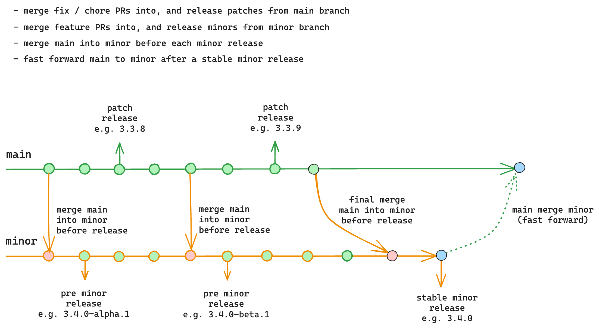

# Maintenance Team Guidelines

this document is mainly intended for team members responsible for maintaining the project. It provides guidelines on how to triage issues, review & merge PRs, and publish releases.

- [Issue Triage Workflow](#issue-triage-workflow)
- [Pull Request Review Guidelines](#pull-request-review-guidelines)
  - [Reviewing a Fix](#reviewing-a-fix)
  - [Reviewing a Refactor](#reviewing-a-refactor)
  - [Reviewing a Feature](#reviewing-a-feature)
  - [Common Considerations for All PRs](#common-considerations-for-all-prs)
- [PR Merge Rules for Team Members](#pr-merge-rules-for-team-members)
- [Git Branch and Release Workflow](#git-branch-and-release-workflow)

## Issue Triage Workflow

## Pull Request Review Guidelines

The first step of reviewing a PR is to identify its purpose. We can usually put a PR in one of these categories:

- **Fix**: fixes some wrong behavior. Usually associated with an issue that has a reproduction of the behavior being fixed.
- **Refactor**: improves performance or code quality, but does not affect behavior.
- **Feature**: implements something that increases the public API surface.

Depending on the type of the PR, different considerations need to be taken into account.

### Reviewing a Fix

- Is the PR fixing a well defined issue / bug report?
  - If not, ask to clarify context / provide reproduction or failing test case
- In most cases, a fix PR should include a test case that fails without the fix.
- Is it the right fix?
  - If not, guide user to rework the PR.
  - If the needed change is small and obvious, can directly push to the PR or add inline suggestions to reduce the back-and-forth.
- Is the cost justified?
  - Sometimes the fix for a rare edge case might be introducing disproportionately large overhead (perf or code size). We should try our best to reduce the overhead to make the fix a reasonable tradeoff.
- If the reviewer is not sure about a fix, try to leave a comment explaining the concerns / reservations so the contributor at least gets some feedback.

#### Verifying a Fix

- **Always locally verify that the fix indeed fixes the original behavior, either through a reproduction or a failing test case.**
- it will run [jenkins-ci](http://192.168.160.230:8080/) before every release.
- Take extra caution with snapshot tests! The CI can be "passing" even if the code generated in the snapshot contains bugs. It's best to always accompany a snapshot test with extra `expect(code).toMatch(...)` assertions.

### Reviewing a Refactor

- Performance: if a refactor PR claims to improve performance, there should be benchmarks showcasing said performance unless the improvement is self-explanatory.

- Code quality / stylistic PRs: we should be conservative on merging this type PRs because (1) they can be subjective in many cases, and (2) they often come with large git diffs, causing merge conflicts with other pending PRs, and leading to unwanted noise when tracing changes through git history. Use your best judgement on this type of PRs on whether they are worth it.

  - For PRs in this category that are approved, do not merge immediately. Group them before releasing a new minor, after all feature-oriented PRs are merged.

### Reviewing a Feature

- Feature PRs should always have clear context and explanation on why the feature should be added, ideally in the form of an RFC(request for comments). If the PR doesn't explain what real-world problem it is solving, ask the contributor to clarify.

- Decide if the feature should require an RFC process. The line isn't always clear, but a rough criteria is whether it is augmenting an existing API vs. adding a new API. Some examples:

  - Adding a new built-in component or directive is "significant" and definitely requires an RFC.
  - Template syntax additions like adding a new `v-on` modifier or a new `v-bind` syntax sugar are "substantial". It would be nice to have an RFC for it, but a detailed explanation on the use case and reasoning behind the design directly in the PR itself can be acceptable.
  - Small, low-impact additions like exposing a new utility type or adding a new app config option can be self-explanatory, but should still provide enough context in the PR.

- Always ask if the use case can be solved with existing APIs or components, so we want to make sure every new addition either solves something that wasn't possible before, or significantly improves the developer experience.

### Common Considerations for All PRs

- Scope: a PR should only contain changes directly related to the problem being addressed. It should not contain unnecessary code style changes.

- Implementation: code style should be consistent with the rest of the codebase, follow common best practices. Prefer code that is boring but easy to understand over "clever" code.

- Size: bundle size matters. We should always aim to realize the desired changes with the smallest amount of code size increase.

- Potential Breakage
  - avoiding runtime behavior breakage is the highest priority
    - if not sure, use `jenkins-ci` to verify!
  - some fix inevitably cause behavior change, these must be discussed case-by-case
  - type level breakage (e.g upgrading TS) is possible between minors

## PR Merge Rules for Team Members

Given that the PR meets the review requirements:

- Chore / dependencies bumps: can merge directly.
- Fixes / refactors: can merge with two or more approvals from team members and should have four eyes on the PR.
  - If you believe a PR looks good but you are not 100% confident to merge, label with "ready for merge" and Albaraa or Sami will provide a final review before merging.
- Features: if approved by two or more team members, label with "ready to merge". Albaraa or Sami will review periodically, or they can be raised and discussed at team meetings.

## Git Branch and Release Workflow

We use two primary work branches: `main` and `minor`.

- The `main` branch is for stable releases. Changes that are bug fixes or refactors that do not affect or causing breaking change. We periodically release patch releases from the `main` branch.

- The `minor` branch is the WIP branch for the next minor release. Changes that are new features or those that affect public API behavior should land in this branch. We will periodically release pre-releases (alpha / beta) for the next minor from this branch.

Before each release, we merge latest `main` into `minor` so it would include the latest bug fixes.

When the minor is ready, we do a final merge of `main` into `minor`, and then release a stable minor from this branch (e.g. `3.4.0`). After that, the `main` branch is fast-forwarded to the release commit, so the two branches are synced at each stable minor release.

### Reasoning Behind the Workflow

The reason behind this workflow is to allow merging and releasing of fixes and features in parallel. using linear trunk-based development model results in a clean git history, the downside is that it need to be careful about when to merge patches vs. features.

But in reality, there are always bugs to fix and patch release to work on - this caused the intervals between minors to drag on longer than we had hoped, and many feature PRs were left waiting for a long period of time.

This is why we decided to separate bug fixes and feature PRs into separate branches. With this two-branch model, we are able to merge and release both types of changes in parallel.
