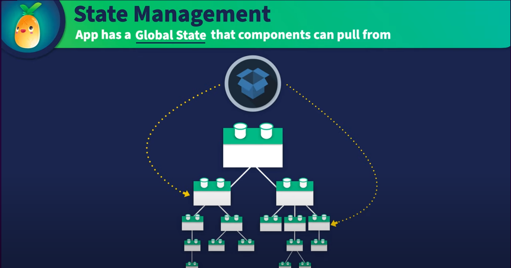

# Style Guide

This file describes de **_required_** Style Guide to keep the Best Practices on develop new features or improve/change existents one.

## Project folder structure

**_Always_** follow the folder structure below:

```sh
.github/
.husky/
.vscode/
docker/
docs/
public/
src/
    assets/
    components/
    composables/
    i18n/
    layouts/
    models/
    plugins/
    router/
    services/
    stores/
    tools/
    views/
  App.vue
  main.js
.browserslistrc
.env
.env.example
.eslintrc.cjs
.gitignore
.prettierrc.json
.stylelintrc.json
commitlint.config.js
cypress.config.mjs
index.html
Jenkinsfile
package.json
pnpm-lock.yaml
postcss.config.js
README.md
SECURITY.md
tailwind.config.js
vite.config.js
vitest.config.js
```

Explanations:

- `public/`: contains static assets that are not imported anywhere in the source code (for example, favicons, images, etc.)
- `src/`: used to place Components, Services, etc, that are common for whole application
- `assets/`: a directory that contains files or images that need to processing assets such as SASS, or JavaScript
- `components/`: all components should be placed here, a component is a reusable Vue instance with a name (for example, `BaseButton.vue`)
- `composables/`: used to store Vue Composition API functions that can be reused across the application
- `i18n/`: used to store i18n configuration files it should be named as en.yml, ar.yml, etc
- `layouts/`: used to store layouts components (for example, `DefaultLayout.vue`)
- `models/`: TypeScript interfaces/classes mapping the entities
- `plugins/`: used to store Vue plugins (for example, `vuetify.js`)
- `router/`: used to store Vue Router configuration files (for example, `index.js`)
- `services/`: TypeScript classes that encapsulate the business logic of the application (for example, `Customizer.service.ts`)
- `stores/`: Pinia stores used to store application state (for example, `UserStore.ts`)
- `tools/`: used to store utility functions like translate, format, etc
- `views/`: used to store routed pages (for example, `Home.vue`)
- `App.vue`: the root component
- `main.js`: the entry point of the application
- `routes.js`: place the routes list of the module as an array (typed as `RouteConfig` from `vue-router`), and export this list as default. E.g.:

```ts
import { createRouter, createWebHistory } from 'vue-router'
import copRoute from '@/router/copRoute'
import managementRoute from '@/router/managementRoute'
import HomeView from '@/views/HomeView.vue'
import DefaultLayout from '@/layouts/DefaultLayout.vue'
import LoginView from '@/views/LoginView.vue'

const router = createRouter({
  history: createWebHistory(import.meta.env.BASE_URL),
  routes: [
    {
      path: '/',
      component: DefaultLayout,
      children: [
        {
          path: '/',
          name: 'home',
          component: HomeView,
          meta: {
            title: 'Home Page'
          }
        },
        ...copRoute,
        ...managementRoute
      ]
    },
    {
      path: '/login',
      name: 'login',
      component: LoginView,
      meta: {
        title: 'Login Page'
      }
    }
  ]
})

router.beforeEach((to, from, next) => {
  document.title = to.meta.title
  next()
})
export default router
```

so you can import the routes list in `router/index.js` for example: coprRoute, managementRoute, etc
it should be same as views folder name and should the router file name should be same as the view name and have the same path for example:
login view should be in views folder and the file name should be LoginView.vue and the router path should be /login
and all views that use DefaultLayout should be children of it. I will explain more in the presentation 😊

## Conventions

First all, it's recommending to read [Official Vue Style Guide](https://vuejs.org/style-guide/), as many rules described there are used here.

### Use a Modular Architecture

A **modular architecture** is a software design approach that emphasizes breaking down a large system into smaller, independent modules or components that can be easily maintained, tested, and reused. In the context of a Vue.js project, a modular architecture involves breaking down your application into smaller, reusable components that can be easily managed and scaled.

Here are some best practices to follow:

- **Use Pinia to manage state**: Pinia is a state management. so what is the state management mean?
  it's a way to manage the state of the application in one place and share it between components.
  so you can use it to share data between components and it's reactive so when you change the data in one component it will change in all components that use it.
  here is a picture to explain it:
  

and here is example of how to use Pinia:

`counterStore.ts`

```ts
import { useStorage } from '@vueuse/core' // this is a library to use localStorage
import { defineStore } from 'pinia' // import pinia

/* 
 defineStore is a function that takes two arguments the first one is the store id and the second one is the store object
 the store object has three properties state, getters, actions
 state is a function that returns the state of the store
 getters is an object that has functions that return the state of the store
 actions is an object that has functions that change the state of the store
*/
export const useCounterStore = defineStore('counterId', {
  state: () => ({
    count: useStorage('count', 0) // this is a reactive variable that is saved in localStorage
  }),
  getters: {
    doubleCount: (state) => state.count * 2 // this is a function that return the double of the count
  },
  actions: {
    increment() {
      // this is a function that increment the count
      this.count++
    },
    decrement() {
      // this is a function that decrement the count
      this.count--
    }
  }
})
```

`CounterView.vue`

```html
<script setup>
  import { useCounterStore } from '@/stores/counterStore'
  const counterStore = useCounterStore()
</script>
<template>
  <div>
    <p>Count: {{ counterStore.count }}</p>
    // this is a reactive variable that is saved in localStorage
    <p>Double count: {{ counterStore.doubleCount }}</p>
    <button @click="counterStore.increment">+</button>
    <button @click="counterStore.decrement">-</button>
  </div>
</template>
```

also you can create composables to use the store in the components in same way.

- **Utilize components for UI elements**:separate your UI into more manageable, scalable, and smaller elements. By doing this, you can prevent code duplication and guarantee consistency throughout your program. we use vuetify components to build the UI, so we don't need to create components for UI elements most of the time. and all vuetify components should be in kebab-case for example: `<v-btn />` not `<vBtn />`
- **Using composable for reusable functionality**: Use composable functions to separate your code into smaller, reusable functions that can be easily managed and scaled. Composable functions can be used to encapsulate business logic and data fetching logic, among other things.

here is an example of how to use composable:
`useMousePosition.ts`

```ts
import { ref, onMounted, onUnmounted } from 'vue'

// by convention, composable function names start with "use"
export function useMouse() {
  // state encapsulated and managed by the composable
  const x = ref(0)
  const y = ref(0)

  // a composable can update its managed state over time.
  function update(event) {
    x.value = event.pageX
    y.value = event.pageY
  }

  // a composable can also hook into its owner component's
  // lifecycle to setup and teardown side effects.
  onMounted(() => window.addEventListener('mousemove', update))
  onUnmounted(() => window.removeEventListener('mousemove', update))

  // expose managed state as return value
  return { x, y }
}
```

`MousePositionView.vue`

```html
<script setup>
  import { useMouse } from '@/composables/useMouse'
  const { x, y } = useMouse()
</script>
<template>
  <div>
    <p>Mouse position: {{ x }}, {{ y }}</p>
  </div>
</template>
```

- **Break down your UI into components**: Identify UI elements that can be reused across different parts of your application and create individual components for them. For example, you can create a component for a navigation bar, a component for a search bar, and so on.
- **Keep components small and focused**: Each component should have a clear and specific purpose. Avoid creating components that are too large or that have multiple responsibilities.
- **Use props and events to communicate between components**: Use props to pass data from parent components to child components, and events to emit data from child components to parent components.
- **Use slots for flexibility**: Use slots to allow the content of a component to be customized by the parent component.
- **Use a folder structure for components**: Use a logical folder structure to organize your components. For example, you can group related components into a “components” folder, and organize them further into subfolders as needed.

### Consistent Naming Convention

The following advice will help you implement a consistent naming scheme in your Vue.js project:

- **Use camelCase for variables and functions**: In JavaScript, camelCase is the convention for naming variables and functions. This means that the first letter of the first word is lowercase, and the first letter of each subsequent word is uppercase. For example: `myVariable`, `myFunction`.
- **Use Captial for constants**: In JavaScript, constants are typically named using all capital letters. For example: `CONSTANT`. exept for the constants that are used in the store and composables and arrow functions its name should be camelCase.
- **Use PascalCase for components**: In Vue.js, PascalCase is the convention for naming components. This means that the first letter of each word is uppercase, and there are no separators between words. For example: `MyComponent`.
- **other files names**: Except for `.vue` files, use suffix indicating what resource is in that file.
- **Use BEM for CSS classes**: BEM (Block Element Modifier) is a naming convention for CSS classes that helps you create reusable components. It uses a double underscore (**) to separate the block from the element, and a double dash (--) to separate the element from the modifier. For example: `my-component**my-element--my-modifier`.
- **Use consistent prefixes or suffixes**: You can use consistent prefixes or suffixes to indicate the type of file, component, or variable. For example, you could use a prefix like “Base” for base components that are used across your application, or a suffix like “Service” for service classes that interact with APIs.
- **Be descriptive**: Use descriptive names that accurately reflect the purpose of the file, component, or variable. For example, use names like `userProfileForm.vue` or `getUsersService.js` instead of generic names like `form.vue` or `service.js`.
  all names singular for example: `userProfileForm.vue` not `userProfileForms.vue` and `getUsersService.js` not `getUsersServices.js`

### Folder Structure

Here are some pointers for using a folder structure to arrange the project:

- **Group related components**: a “components” folder and organize your components into subfolders based on their functionality or purpose. For example, you can have a “navbar” folder for all components related to the navigation bar, and a “forms” folder for all form-related components.
- **Separate views and components**: a “views” folder for your top-level views, and separate them from your components. This makes it easier to distinguish between the views that represent different pages of your application and the components that are used to build those pages.
- **“composables” folder**: a “composables” folder to store your composable functions. This makes it easier to find and reuse your composable functions across your Vue.js project.
- **Group Pinia modules by feature**: using Pinia to manage your application state, group your modules by feature or functionality. This makes it easier to maintain and debug your state management code.
- **subfolders for assets**: such as images, fonts, or CSS files, create subfolders within your “assets” folder to organize them by type or purpose.

### Code Splitting

The following advice will help you use code splitting in the project:

- **dynamic imports**: Use dynamic imports to load components on demand. This can improve the performance of your application by reducing the initial load time and memory usage of your application. I also add unplugin-vue-components to use dynamic imports for components.

- **async component**: The Vue.js async component allows you to lazy load components on demand, reducing the initial load time of your application. To use this feature, simply define your component as an async function that returns the component definition.

- **don't change dom directly**: Avoid changing the DOM directly. Instead, use Vue.js to update the DOM when the state of your application changes. for example, if you want to change the style of an element use v-bind:style instead of changing the style directly.

```html
<!-- Bad -->
<div id="app"></div>
<script>
  document.getElementById('app').style.color = 'red'
</script>

<!-- Good -->
<div id="app" :style="{ color: 'red' }"></div>
```

- **No inline styles**: Avoid using inline styles. Instead, use CSS classes to style your components. This makes it easier to maintain and update your styles, and allows you to reuse styles across multiple components.

```html
<!-- Bad -->
<div style="color: red"></div>

<!-- Good -->
<div class="text-red"></div>
```

or you can use tailwindcss to style your components.

```html
<!-- tailwindcss -->
<div class="text-red-500"></div>
```

- **All styles in assets/styles**: All styles should be in assets/styles folder and it should be in scss format.

- **use TypeScript when possible**: Use TypeScript to add type checking to your code. This can help you catch errors early on and improve the maintainability of your codebase.

- **use ESLint and Prettier**: Use ESLint and Prettier to enforce a consistent code style across your Vue.js project. This can help you avoid common mistakes and improve the readability of your codebase.

- **use i18n**: Use i18n so every text in the application can be translated to any language. do not use text directly in the components.

for example:

```html
<!-- Bad -->
<div>hello world</div>

<!-- Good -->
<div>{{ $t('helloWorld') }}</div>
```

- **don't write functions that do more than one thing**: Write functions that do one thing and do it well. This makes it easier to test and debug your code, and allows you to reuse your functions across multiple components.

- **multi-word component names**: Always try naming Components with multi-word, except for root `App` components, and built-in components provided by Vue, such as `<transition>` or `<component>`.

This prevents conflicts with existing and future HTML elements, since all HTML elements are a single word.

```sh
# Bad

components/
  Todo.vue
```

```sh
# Good

components/
  TodoItem.vue
  TodoList.vue
```

- **Filenames of single-file components should be always PascalCase.**

PascalCase works best with autocompletion in code editors, as it’s consistent with how we reference components in JS(X) and templates, wherever possible.

```sh
# Bad

components/
  mycomponent.vue
  myComponent.vue
  my-component.vue
```

```sh
# Good

components/
  MyComponent.vue
```

- **other files names**

Except for `.vue` files, use suffix indicating what resource is in that file. Follow these rules:

- Services: `<Name>.service.ts`, e.g.: `Customizer.service.ts`
- Models: `<Name>.model.ts`
- Store (Pinia): `<Name>.store.ts`

- **base component names**

_Base components (a.k.a. presentational, dumb, or pure components) that apply app-specific styling and conventions should all begin with `Base` prefix._

```sh
# Bad

components/
  MyButton.vue
  VueTable.vue
  Icon.vue
```

```sh
# Good

components/
  BaseButton.vue
  BaseTable.vue
  BaseIcon.vue
```

- **DRY (Don't Repeat Yourself)**: Avoid repeating yourself. Instead, use functions to encapsulate common logic and reuse it across the project.

- **Single-instance component names**: Components that should only ever have a single active instance should begin with the `The` prefix, to denote that there can be only one.

```sh
# Bad
components/
  Modal.vue
  Settings.vue
  UserProfile.vue
```

```sh
# Good
components/
  TheModal.vue
  TheSettings.vue
  TheUserProfile.vue
```

- **Self-closing components**: Components with no content should be self-closing in single-file components, string templates, and JSX - but never in DOM templates.

```sh
# Bad

<MyComponent></MyComponent>
```

```sh
# Good

<MyComponent />
```

- **typescript type checking**: type checking should have this style `const a: string = 'hello world'` not this `const a = 'hello world'`
  but its bettter to use this style when you deal with ref :

```ts
// Bad
import type { Ref } from 'vue'
let isDrawer: Ref<boolean> = ref(false)

// Good
let isDrawer = ref<boolean>(false)
```

second thing use interface instead of type when you want to create a type for object.

```ts
// Bad

type User = {
  name: string
  age: number
}

// Good

interface User {
  name: string
  age: number
}
```

also,

```ts
// Bad
const LIST_OF_MODES: Ref<{ text: string }[]> = ref([
  { text: 'COP ' },
  { text: 'Plans & Training ' },
  { text: 'ISTAR ' },
  { text: 'Fire Support ' },
  { text: 'Logistic ' },
  { text: 'Management ' }
])

// Good
const LIST_OF_MODES = ref<Mode[]>([
  { text: 'COP Mode', icon: 'mdi-widgets-outline' },
  { text: 'Plans & Training Order', icon: 'mdi-account-outline' },
  { text: 'ISR Mode', icon: 'mdi-star-box-outline' },
  { text: 'Fire Support Mode', icon: 'mdi-fire' },
  { text: 'Logistic Mode', icon: 'mdi-truck-minus-outline' }
])

// mode.ts

export interface Mode {
  text: string
  icon: string
}
```

- **Avoid `v-for` with `v-if`**

_Never use `v-if` on the same element as `v-for`._

There are two common cases where this can be tempting:

- To filter items in a list (e.g. `v-for="user in users" v-if="user.isActive"`). In these cases, replace users with a new computed property that returns your filtered list (e.g. activeUsers).

- To avoid rendering a list if it should be hidden (e.g. `v-for="user in users" v-if="shouldShowUsers"`). In these cases, move the `v-if` to a container element (e.g. ul, ol).

[> Detailed explanation in the Vue Style Guide](https://vuejs.org/v2/style-guide/#Avoid-v-if-with-v-for-essential)

- **Full-word component names**: Use full-word component names in template (or JSX). This allows separating between the component’s name and the HTML elements in the template. For example, `BaseButton` instead of `Base` or `Button`.

### Linting and Formatting Tools

follow these hints:

- **install ESLint**: ESLint is a popular linting tool for JavaScript that can help you enforce a consistent code style across your Vue.js project. ESLint can be used alongside Prettier to format your code automatically as you write it.

- **install Prettier**: Prettier is a popular code formatting tool that can be used alongside ESLint to format your code automatically as you write it. Prettier can be configured to enforce a consistent code style across your Vue.js project.

- **all configuration**: it will be in the root of the project in `.eslintrc.cjs` and `.prettierrc.json` files.

### How to Document Your code

- **Use JSDoc**: JSDoc is a popular documentation tool for JavaScript that allows you to add comments to your code that are formatted as tags. These tags can be used to document the purpose, parameters, and return values of functions, among other things.

- **Document your components**: When creating components, document their props, events, and slots. This can help other developers understand how to use your components and how they fit into the overall structure of your Vue.js project.

- **clear and concise comments**: Write comments that are clear and concise. Use plain language and avoid technical jargon as much as possible. Also, make sure your comments are up to date and accurate.

- **consistent style**: we will use a consistent style for your comments across your Vue.js project. This can make it easier to read and understand the codebase, especially if you’re working with multiple developers.

### Testing

- **Cypress or Vitest**: Cypress is a browser-based test runner. vitest is a headless test runner. so we will use Vitest for all headless logic in our project and Cypress for all browser-based logic.

_what is headless and browser-based logic?_

- headless logic: logic that doesn't need to be in the browser for example get data from the API.
- browser-based logic: logic that needs to be in the browser for example click on a button.

#### More details about the rules

[> Follow Official Vue Style Guide Rule](https://vuejs.org/v2/style-guide/)
